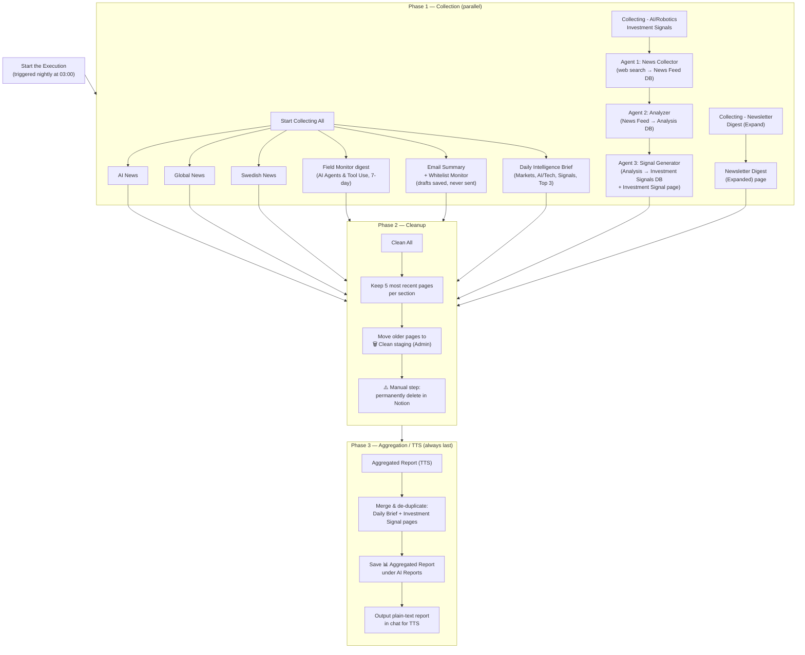

# Execution Flow Diagram

Visual flow for the nightly **Start the Execution** run. See the [Description](README.md) page for the full written explanation of each step.

```mermaid
flowchart TD
    Start["Start the Execution\n(triggered nightly at 03:00)"] --> Phase1

    subgraph Phase1["Phase 1 — Collection (parallel)"]
        direction TB
        SCA["Start Collecting All"]
        AIR["Collecting - AI/Robotics\nInvestment Signals"]
        NWS["Collecting - Newsletter\nDigest (Expand)"]

        SCA --> N1["AI News"]
        SCA --> N2["Global News"]
        SCA --> N3["Swedish News"]
        SCA --> FM["Field Monitor digest\n(AI Agents & Tool Use, 7-day)"]
        SCA --> EM["Email Summary\n+ Whitelist Monitor\n(drafts saved, never sent)"]
        SCA --> DIB["Daily Intelligence Brief\n(Markets, AI/Tech, Signals, Top 3)"]

        AIR --> A1["Agent 1: News Collector\n(web search → News Feed DB)"]
        A1 --> A2["Agent 2: Analyzer\n(News Feed → Analysis DB)"]
        A2 --> A3["Agent 3: Signal Generator\n(Analysis → Investment Signals DB\n+ Investment Signal page)"]

        NWS --> ND["Newsletter Digest\n(Expanded) page"]
    end

    N1 & N2 & N3 & FM & EM & DIB & A3 & ND --> Phase2

    subgraph Phase2["Phase 2 — Cleanup"]
        direction TB
        CA["Clean All"]
        CA --> Keep["Keep 5 most recent pages\nper section"]
        Keep --> Move["Move older pages to\n🗑️ Clean staging (Admin)"]
        Move --> Manual["⚠️ Manual step:\npermanently delete in Notion"]
    end

    Phase2 --> Phase3

    subgraph Phase3["Phase 3 — Aggregation / TTS (always last)"]
        direction TB
        AGG["Aggregated Report (TTS)"]
        AGG --> Merge["Merge & de-duplicate:\nDaily Brief + Investment Signal pages"]
        Merge --> Save["Save 📊 Aggregated Report\nunder AI Reports"]
        Save --> Out["Output plain-text report\nin chat for TTS"]
    end
```
